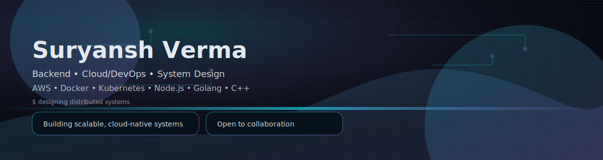

  
  

Welcome to my GitHub profile!  
I’m **Suryansh Verma**, a **Backend Developer and Cloud/DevOps Engineer** passionate about building **scalable, distributed, cloud-native systems** using **Node.js, Golang, C++, Docker, Kubernetes, and AWS**.

  

## ⚙️ My Tech Stack  

| Area | Skills |
|---|---|
| 👨‍💻 Languages |  |
| 🖥️ Frontend |  |
| 🧠 Backend |  |
| 🗄️ Databases & Messaging |  |
| ☁️ Cloud & DevOps |  |
| 🧰 Tools |  |

  

## 📊 GitHub Analytics  

  
  

  

## 📬 Connect With Me  

📧 **Email:** [suryanshverma.dev.official@gmail.com](mailto:suryanshverma.dev.official@gmail.com)    
💼 **LinkedIn:** [linkedin.com/in/suryanshverma](https://linkedin.com/in/suryanshverma)  
🌐 **Portfolio:** [suryanshverma.vercel.app](https://suryanshverma.vercel.app)  
💻 **LeetCode:** [leetcode.com/suryanshvermaa](https://leetcode.com/suryanshverma_1) 
 💬 Always open to collaborating on **cloud, backend, or open-source** projects!  

  

## 🌩️ Featured Projects

  
<b>🚀 <a href="https://github.com/suryanshvermaa/scsCloud.git">SCS Cloud Platform</a></b> — Cloud-native platform

  - 🎬 HLS Transcoding (FFmpeg multi-bitrate outputs)
  - 🌐 Static Site Hosting for React/Vite projects
  - 🐳 Docker Container Deployments (like AWS ECS)
  - ☸️ Kubernetes-ready deployment (NGINX Ingress + Kind)
  - 💳 Payments with Cashfree API & Redis-based BullMQ queue
  - 🤖 Integrated AI Assistant (Groq) for developer workflows
  - 🐳 Docker Compose for local dev + Kubernetes for production

  <b>Tech Stack:</b> React, Node.js, Express, MongoDB, Docker, AWS, Kubernetes

  
<b>🧠 <a href="https://hackslashnitp.vercel.app">Hackslash Official Website</a></b> — Next.js community website

  - ⚡ Built using <b>Next.js, TailwindCSS &amp; Framer Motion</b>
  - 📈 Reduced navigation bounce rate by 15%
  - 🚀 Improved engagement by 10%

  <b>Tech Stack:</b> Next.js, TailwindCSS, Framer Motion

  
<b>🔧 <a href="https://github.com/suryanshvermaa/create-express-mongo-prod">create-express-mongo-prod</a></b> — Express.js production scaffolder

  - 📦 Published on NPM — <b>300+ downloads</b> in first week
  - 🛠️ Includes Docker, ESLint, Prettier, Mongo, AWS S3 integration
  - ⚡ Setup new Node.js backends in minutes

  
<b>🚀 <a href="https://github.com/suryanshvermaa/create-drogon-app">create-drogon-app</a></b> — Drogon (C++) backend generator

  - 📦 Multiple templates (JWT, Postgres, AWS S3)
  - ⚡ Ready-to-build C++17 CMake setup
  - 🐳 Dockerfile for containerized deployment
  - 🧩 Modular architecture for scalable C++ backends
  - 🛠️ Simplifies C++ backend development with Drogon framework

  
<b>⚡ <a href="https://github.com/suryanshvermaa/my-fastest-drogon-app-cpp.git">Scalable Todo Management System</a></b> — C++ backend + CI/CD

  - 🔐 JWT + bcrypt authentication
  - 🧩 Modular middleware architecture
  - ☸️ Jenkins CI/CD + Kubernetes deployment
  - 🐳 Dockerized for easy deployment
  - 🗄️ PostgreSQL database integration
  - 🚀 High-performance C++ backend with Drogon framework

## 🏆 Certifications  
- 🏅 **AWS Educate – Compute (EC2)** Certified ([Credentials](https://www.credly.com/badges/7d2a02d2-b7e3-46f3-a9b8-2b252d97ff45/public_url))
- 🏅 **AWS Educate – Storage (S3)** Certified ([Credentials](https://www.credly.com/badges/d0c49231-ebf8-461d-8396-11e6cf878013/public_url))

  

