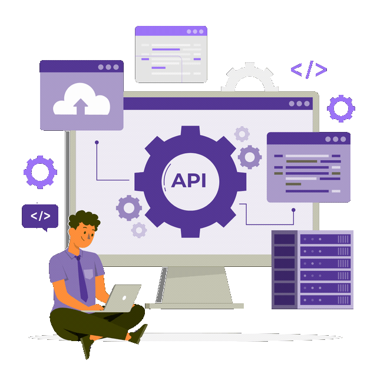

# Hi, I'm Suryansh Verma 👋

📍I am Suryansh from India, and I do backend development.
I enjoy learning new technologies and exploring tech.

- 🚀 Building cloud-native applications and developer tools
- ☁️ Working with AWS, Docker, Kubernetes, and automation
- 🌱 Currently learning Go, System Design, and distributed systems
- 🛠️ Exploring cloud infrastructure, CI/CD, and platform engineering
- ⚡ Fun fact: I spend more time optimizing deployments than writing code 😆

📫 [LinkedIn](https://linkedin.com/in/suryanshverma) • [Portfolio](https://suryanshverma.vercel.app) • [LeetCode](https://leetcode.com/suryanshverma)

# Languages And Tools

---
