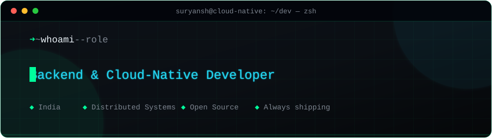
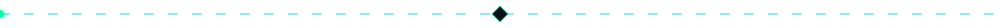

<div align="center">



<a href="https://suryanshverma.vercel.app">
  
</a>
<a href="https://linkedin.com/in/suryanshverma">
  
</a>
<a href="https://leetcode.com/suryanshverma_1">
  
</a>
<a href="https://github.com/suryanshvermaa">
  
</a>



</div>

## `whoami`

```bash
➜ ~ cat suryansh.json
```

```jsonc
{
  "name":     "Suryansh Verma",
  "location": "India 🇮🇳",
  "role":     "Backend & Cloud-Native Developer",
  "focus":    ["distributed systems", "platform engineering", "developer tooling"],
  "learning": ["Go", "System Design", "Kubernetes internals"],
  "funFact":  "I spend more time optimising deployments than writing code 😆"
}
```

<table>
<tr>
<td width="55%" valign="top">

**What I'm up to**

- 🚀 &nbsp;Building cloud-native applications and developer tools
- ☁️ &nbsp;Working with **AWS**, **Docker**, **Kubernetes** and automation
- 🌱 &nbsp;Deep-diving **Go**, **System Design** and distributed systems
- 🛠️ &nbsp;Exploring cloud infrastructure, **CI/CD** and platform engineering
- 💬 &nbsp;Happy to talk about backend architecture, DevOps or infra
- 📫 &nbsp;Reach me via [LinkedIn](https://linkedin.com/in/suryanshverma)

</td>
<td width="45%" valign="top" align="center">


</td>
</tr>
</table>


## `ls ~/toolbox`

<div align="center">

**Languages**

[](https://skillicons.dev)

**Backend & Data**

[](https://skillicons.dev)

**Cloud, DevOps & Tooling**

[](https://skillicons.dev)

</div>


## `git log --stat`

<div align="center">

<a href="https://github.com/suryanshvermaa">
  
</a>
<a href="https://github.com/suryanshvermaa">
  
</a>

<br/>


<br/><br/>

<picture>
  <source media="(prefers-color-scheme: dark)" srcset="https://awesome-github-stats.azurewebsites.net/user-stats/suryanshvermaa?cardType=level&theme=dark&preferLogin=false" />
  <source media="(prefers-color-scheme: light)" srcset="https://awesome-github-stats.azurewebsites.net/user-stats/suryanshvermaa?cardType=level&theme=github&preferLogin=false" />
  
</picture>

</div>

<details>
<summary><b>📈 &nbsp;Contribution activity graph</b></summary>
<br/>
<div align="center">
  
</div>
</details>

<details>
<summary><b>🏆 &nbsp;Trophies</b></summary>
<br/>
<div align="center">
  
</div>
</details>


## `./solve --platform leetcode`

<div align="center">
<picture>
  <source media="(prefers-color-scheme: dark)" srcset="https://leetcard.jacoblin.cool/suryanshverma_1?theme=dark&font=Roboto&ext=contest" />
  <source media="(prefers-color-scheme: light)" srcset="https://leetcard.jacoblin.cool/suryanshverma_1?theme=light&font=Roboto&ext=contest" />
  
</picture>
</div>


## `snake --eat contributions`

<div align="center">
<picture>
  <source media="(prefers-color-scheme: dark)" srcset="https://raw.githubusercontent.com/suryanshvermaa/suryanshvermaa/output/snake-dark.svg" />
  <source media="(prefers-color-scheme: light)" srcset="https://raw.githubusercontent.com/suryanshvermaa/suryanshvermaa/output/snake.svg" />
  
</picture>
</div>

<div align="center">


</div>
